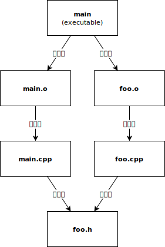
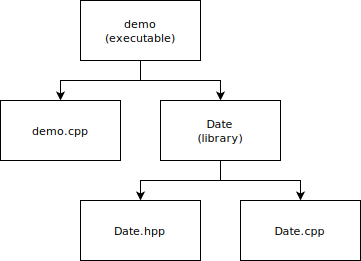

# CMake 基本使用

## 构建工具

在 [多文件的章节](./multi-files-programming.md#使用头文件) 中, 生成可执行文件 `main` 的过程, 也叫做 **构建** (build) 可执行文件 `main` 的过程. 在这个过程中, 我们的 *目标* 是生成可执行程序 `main`.

简单来说, 生成这个目标需要 `main.cpp`, `foo.h` 以及 `foo.cpp` 三个文件.

> 更具体地说, 生成可执行程序 `main` *依赖* `main.o` 和 `foo.o` 两个目标文件, 而这两个目标文件, 又分别由对应的 `cpp` 文件生成.

<figure>
  
  <figcaption>可执行程序 main 的依赖关系图</figcaption>
</figure>

其中, `main.cpp` 和 `foo.cpp` 又依赖于 `foo.h` 文件 (因为包含了前二者包含了后者 `foo.h`).

假如目标文件对应的 `cpp` 文件发生了更改 (或者其所包含的头文件发生了更改), 都需要重新生成相应的目标文件, 才能保证最终链接之后生成的可执行程序是最新的.

不同于曾经的单文件, 现在要构建一个目标涉及到了多个文件. 有些问题需要解决:

- 每次都需要输入多条命令才能完成编译链接;
- 希望减少编译的时间, 只希望编译发生了更改的部分, 因此需要判断哪些文件发生了更改, 从而只对有必要重新编译的文件进行编译;
- ...

如果项目更多, 项目之间有依赖关系等等, 则可能需要输入更多更复杂的命令, 也需要留意更多的文件. 如果全由用户来做, 很容易出现差错.

构建工具可以帮助我们自动化上述的流程. 我们告诉构建工具生成目标需要哪些依赖, 构建工具就可以在每次我们需要重新构建目标时, 检测需要重新生成的文件, 并完成构建流程. 

> 一些 IDE 会有自己的构建工具, 但对于初学者, 这个过程并不是那么明显. 往往, 用户将源代码添加进一个 "项目" 中, IDE 便将其视作生成该项目的依赖, 而不需用户显式指定. 

## 使用外部库

以使用外部库为例, 这里使用上一节中整理出来的 `Date` 库作为例子.


那么该怎么调用这个外部库呢? 有多种情况, 一般来讲, 应当将该库的源代码与项目一同进行编译; 也有的时候, 库的开发者不提供源代码, 只有编译好的二进制文件和对应的头文件.

不管属于哪种情况, 都需要包含对应的头文件. 前者需要在链接时提供需要的目标文件, 后者则需要指定需要链接的库文件.

### 头文件包含

首先, 要想使用一个库, 头文件是不可少的. 它能够告诉我们能够使用符号, 并且能够帮助我们顺利完成翻译单元的编译, 从而生成目标文件.

在编译这些使用了外部库的项目时, 由于需要包含外部的头文件, 而外部头文件的位置则是千差万别, 因此一般需要给编译器指定头文件搜索的路径. 

> 关于 `#include` 命令的搜索范围: 当使用双引号 `""` 包含头文件时, 编译器首先查找当前工作目录或源代码目录, 然后再在标准位置查找. 而使用尖括号 `<>` 时, 编译器将在系统的头文件目录中查找. 

比如, 下面的 [demo.cpp](assets/2/demo.cpp) 使用了 `Date` 库, 但是 `#include` 命令只是写出了 `Date.hpp` 的相对路径 (一般也建议这样做), 因此编译时需要指定头文件的搜索路径: 

```cpp
{{#include assets/2/demo.cpp}}
```

### 编译和链接

假设 `Date.hpp` 和 `Date.cpp` 都位于和 `demo.cpp` 同目录下的 `Date` 目录中:

> 下面的这些命令用于示范手动构建 (使用源码的外部库) 的过程, 读者不一定要亲自执行.

切换到 `demo.cpp` 所在目录下.

**首先** 编译 `demo.cpp`, 需要指定头文件搜索路径.

```console
$ c++ demo.cpp -c -o demo.o -I ./Date   # 编译 demo.cpp
```

执行这个命令后, 将在当前目录下得到 `demo.o` 这一目标文件.

**接下来** 编译 `Date.cpp`. 由于 `Date.cpp` 和 `Date.hpp` 处在同一目录下, 所以不需要指定头文件搜索路径.

```console
$ c++ Date/Date.cpp -c -o ./Date.o      # 编译 Date.cpp
```

执行这个命令后, 将在当前目录下得到 `Date.o` 这一目标文件.

**最后**, 将得到的两个目标文件链接起来, 生成最后的可执行文件.

```console
$ c++ demo.o Date.o -o demo             # 链接生成可执行程序 demo
```

需要注意的是, 上述命令的写法并没有体现库的使用, 只是手动的根据依赖情况分别编译源文件, 最后链接生成可执行文件.

现实世界中使用的很多外部库, 通常由包管理器进行管理. 库的头文件搜索路径, 以及要链接的库文件, 通常由包管理器负责记录. 通常有相应的程序, 可以根据这些记录来自动化生成编译命令, 而无需手动输入.

## CMake

经过上述的例子, 可见手动完成构建是很复杂的. 当然, 可以使用构建工具 (如 GNU Make), 并编写对应的脚本, 但是由于其使用起来仍较为复杂, 不够抽象 (仍需编写具体的规则), 以下只介绍使用 CMake 的方法.

> 接下来的内容只概念性的介绍 CMake 的使用. 关于具体使用, 见下一节内容.

使用 CMake 这样一个构建管理工具, 只需编写一个 `CMakeLists.txt` 文件, 便可以生成用于不同构建工具的脚本. 

最简单的 CMake 命令, 即是根据一个源文件, 生成一个可执行程序.

```cmake
add_executable(single_file_demo "single_file_demo.cpp")
```

而对于本节中的示例项目, 编写 CMake 脚本也并不复杂.

<figure>
  
  <figcaption>CMake 项目中目标的依赖关系图</figcaption>
</figure>

首先, 为 `Date` 库编写一个 CMake 脚本. 下面的例子定义了一个名为 `Date` 的生成 "库 (library)" 的目标.

[Date/CMakeLists.txt](assets/2/Date/CMakeLists.txt)

```cmake
{{#include assets/2/Date/CMakeLists.txt}}
```

之后, 如果要使用这个库, 便只需要在 CMake 中使用 `add_subdirectory` 命令包含该目录 (作为子项目引入), 即可直接使用这个目标:

[CMakeLists.txt](assets/2/CMakeLists.txt)

```cmake
{{#include assets/2/CMakeLists.txt}}
```

需要注意, 和上边手动操作时的示范不同, 这里 CMake 在构建时会真正生成一个库文件.

CMake 也会自动解析出项目之间的依赖. 比如:

- 编译 `demo.cpp` 需要 `Date` 库的包含目录 (由 `target_include_directories` 命令得到);
- 生成 `demo` 需要 `demo.o` 和 `Date` 库, 即 `Date.lib` (Windows) 或者 `libDate.a` (Unix);
- ...

如果 `add_library` 时使用 `OBJECT` 选项, CMake 将不会生成库文件, 而是将给出的源文件视作一个集合, 然后编译这些翻译单元为目标文件. 对于依赖它的目标, 则使用这些目标文件一并链接. 效果类似于逐一指明可执行程序目标需要的源文件, 但是使用 `OBJECT` 可以让 CMake 不去为每个可执行程序目标重复编译这些翻译单元.
 
```cmake
add_library(Date OBJECT "Date.hpp" "Date.cpp")
```
 
自然, CMake 也可以生成动态库. 不过由于细节较多, 这里暂时不作展开.
