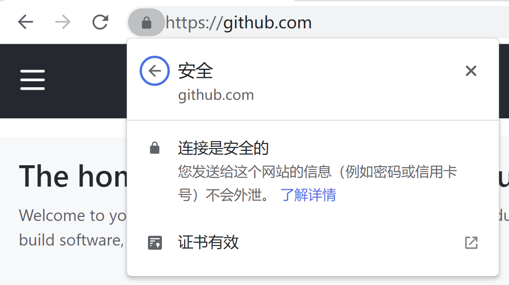

# 使用 SSH 连接到 GitHub

用户可以使用 SSH 协议连接到服务器, 以及进行到远程服务器的认证过程 (认证远程服务器的身份, 以及向服务器证实自己的身份). 

当然, 用户可以用 SSH 来读写自己在 [GitHub](https://github.com) 上的存储仓库中的数据 (并且也推荐这样做). 使用 SSH 建立连接的时候, 用户使用自己本地电脑上一个私有的密钥文件来完成认证.

简单来说, 要配置 SSH 连接, 需要以下两步:

- 生成一个 SSH 密钥文件
- 将 SSH 密钥添加到自己的 GitHub 账号中

之后就是通过 SSH 访问仓库了 (拉取或推送更新). 但是请别着急, 这中间有一些需要注意的地方.

## 关于 SSH

SSH, 全称为 "Secure Shell Protocol", 是一种加密的网络传输协议, 可在不安全的网络中为网络服务提供安全的传输环境. 最常见的用途是用来远程登录系统, 远程执行程序, 传输命令行界面等.

SSH 以 **非对称加密** 实现身份验证. 身份验证其实有多种途径, 常见的一种就是使用密码进行验证的方式, 这个过程中一般是使用自动生成的公钥和私钥来简单地加密网络通信, 以便安全地传输密码; 另外一种就是手动生成一对公钥和私钥, 并使用这些密钥进行认证, 这样便不再需要密码了. 

其中, 公钥需要传输给待访问的计算机中, 而相应的私钥则应由用户自行保管. 

这里需要介绍一下非对称加密的大概过程.

- 用户在和远程计算机通信前, 需要拥有远程计算机的公钥, 远程计算机也应拥有用户的公钥;
- 在用户向远程计算机发送报文时, 用户先使用对方的公钥对报文进行加密, 得到密文后, 对方可以使用自己的私钥进行解密 (由于私钥是妥善保管的, 因此理论上只有远程计算机能够解密报文); 
- 同时, 用户使用自己的私钥对报文进行签名, 该签名可以使用该用户的公钥进行验证 (任何拥有公钥的人都可以验证身份, 但是不能伪造身份).

如果过程反过来, 即远程计算机要向用户发送报文的时候, 也是一样的过程.

因为 SSH 只验证用户是否拥有与公钥相匹配的私钥, 相信读者在阅读了上面的内容后一定能够明白, 在使用 SSH 时, **核实未知密钥的来源** 是非常重要的事情, 也就是说, 如果接受了攻击者的公钥, 就相当于是将攻击者视为合法用户了.

比如, GitHub 就在自己的文档网站上, 给出了 [自己 SSH 密钥的指纹][githubs-ssh-key-fingerprints]. 

密钥指纹可以供用户验证自己到远程服务器的连接. 在用户首次通过 SSH 访问 `github.com` 时, 程序会提示是否将主机添加到信任列表, 这个时候就会显示远程主机的密钥指纹. 这个时候用户需要比对程序中显示的密钥指纹和网站上公布的是否有差误. 如果有问题, 则不应信任该连接 (或者说该公钥).

当然, 用户也需要将自己的公钥提供给 GitHub (`github.com`), GitHub 才会允许连接.

那读者可能会问, 那上述提及的查看密钥指纹以及提供密钥的过程是怎么做到安全可信的呢? 这些过程都是经过网页来进行的, 而我们日常使用 HTTPS 的网页浏览中已经使用了非对称加密; 不过具体的原理和详情这里不再阐述了, 读者可以自行搜索相关资料.

<figure>
<figcaption>浏览器标签页地址栏前的锁状图标说明连接是安全的</figcaption>
</figure>


## 生成 SSH 密钥

说了这么多, 那么究竟该如何操作呢?

### 查看已有的 SSH 密钥

如何查看自己计算机上是否已经有 SSH 密钥了呢? 可以查看 `~/.ssh` 目录下的文件 (对于 Windows 来说, 一般为 `C:/Users/<username>/.ssh`, 类 Unix 系统则为 `/home/<username>/.ssh`), 看是否有类似如下文件名的文件:

- *id_rsa.pub*
- *id_ecdsa.pub*
- *id_ed25519.pub*

其中, `.pub` 后缀表示该文件是公钥文件, 同时应该会有一个与之同名但名没有后缀的文件, 即为私钥文件.

如果不存在这样的文件, 或者根本不存在 `.ssh` 目录, 则说明计算机上不存在 SSH 密钥的文件.

### 创建 SSH 密钥

Windows 上的 Git for Windows 已经包含了 OpenSSH. 其他操作系统则可能需要手动安装 `openssh` 软件包.

下边以 Windows 上使用 Git for Windows 为例, 介绍创建密钥的过程. 其他操作系统应当与 Git Bash 的操作过程类似.

使用 `ssh-keygen` 命令创建密钥 (注意替换为自己在 GitHub 上的电子邮件地址). 这里选用的是 ED25519 算法; 若选用其它的算法, 则命令和生成的文件名会有不同.

```
$ ssh-keygen -t ed25519 -C "your_email@example.com"
```

之后会提示选择密钥存储的路径; 为了方便, 建议 **使用默认的路径**, 直接按回车即可:

```
> Enter a file in which to save the key (/c/Users/you/.ssh/id_rsa): [按 Enter 键]
```

之后还会提示设置 "**通行口令**", 也就是打开 (使用) 密钥时需要的密码. 之前已经说过, 私钥应当妥善保管, 任何时候都不应该泄露给他人. 这里使用口令的目的是添加另一层保护, 不过也可以留空, 直接按回车即可.

如果设置了口令, 则在每次使用密钥的时候都需要输入口令. 也可以使用 `ssh-agent`, 将其配置为缓存通行口令. 笔者觉得这样较为繁琐, 便没有配置 `ssh-agent`, 接下来的文章也不会介绍, 读者如有需要可以自行参考相关资料.

```
> Enter passphrase (empty for no passphrase): [输入一个口令]
> Enter same passphrase again: [再次输入口令]
```

如此便会在 `~/.ssh` 目录下生成身份验证所需的公钥和私钥两个文件. 上文中使用的 RSA 算法, 所以得到的文件默认应为 *id_rsa* (私钥) 和 *id_rsa.pub* (公钥).

### 添加 SSH 密钥

登录 GitHub 后:

- 在页面的右上角找到个人资料图像, 点击后会出现菜单, 选择 "Settings"; 
- 之后在侧边栏的 "Access" 分区下, 找到 "SSH and GPG Keys", 点击进入页面;
- 在 "SSH Keys" 标题下找到 "New SSH Key", 点击进入页面;
- 在 "Title" 对应的文本框内填写该密钥的名称, 用于区分; 比如如果当前待添加密钥是自己的 Windows 笔记本上的, 则可以用 "Windows Laptop" 作为标题;
- 之后将公钥文件中的内容复制进入 "Key" 对应的文本框中;
- 最后点击 "Add SSH key" 完成添加, 注意这时可能会要求用户再次输入 GitHub 账户密码以确认身份.

其他平台的配置过程应当类似.

### 测试 SSH 连接

使用下面的命令测试到 GitHub 的连接:

```
$ ssh -T git@github.com
```

如果初次连接到 `github.com`, 会有类似如下的警告:

```
> The authenticity of host 'github.com (IP ADDRESS)' can't be established.
> RSA key fingerprint is SHA256:nThbg6kXUpJWGl7E1IGOCspRomTxdCARLviKw6E5SY8.
> Are you sure you want to continue connecting (yes/no)?
```

这时我们需要 **验证消息中的指纹** (fingerprint) 是否与 [GitHub 的公钥指纹][githubs-ssh-key-fingerprints] 一致. 如果一致, 则输入 `yes` 并按 Enter 提交, 之后本地计算机将会记录该公钥, 将其加入 `github.com` 的已知主机中.

[githubs-ssh-key-fingerprints]: https://docs.github.com/en/authentication/keeping-your-account-and-data-secure/githubs-ssh-key-fingerprints

之后, **验证返回的消息中是否包含了自己的用户名**.

至此, 添加完成, 可以使用 SSH 访问 GitHub 上的仓库了. 如果本地已有仓库, 使用的是 HTTPS 链接作为远程 URL, 可以修改为 SSH 链接. (目前 GitHub 已强制要求使用 SSH 连接完成向远端仓库的推送.)

查看当前仓库的远程 URL:

```
$ git remote -v
```

修改 URL (以修改 `origin` 为例):

```
$ git remote set-url origin git@github.com:USERNAME/REPOSITORY.git
```

修改完成后可以使用上述命令验证是否修改成功.

## 其他注意事项

正如上文所说, SSH 比较安全, 并且就目前来说, 大陆对 GitHub 的 HTTPS 访问已经被阻断, 但是 SSH 尚能正常使用. 当然这并不意味着通过 SSH 访问, 就是安全而不会被发现的.

## 参考链接

- [About SSH - GitHub Docs](https://docs.github.com/en/authentication/connecting-to-github-with-ssh/about-ssh)
- [Connect to your Git repos with SSH - Azure Repos - Microsoft Docs](https://docs.microsoft.com/en-us/azure/devops/repos/git/use-ssh-keys-to-authenticate)
